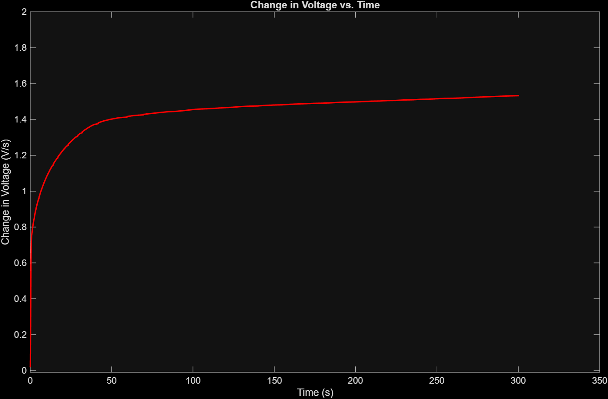
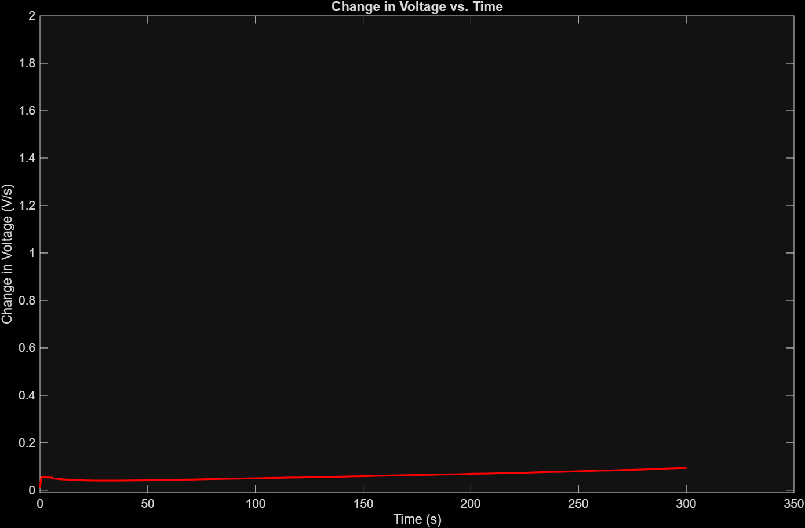
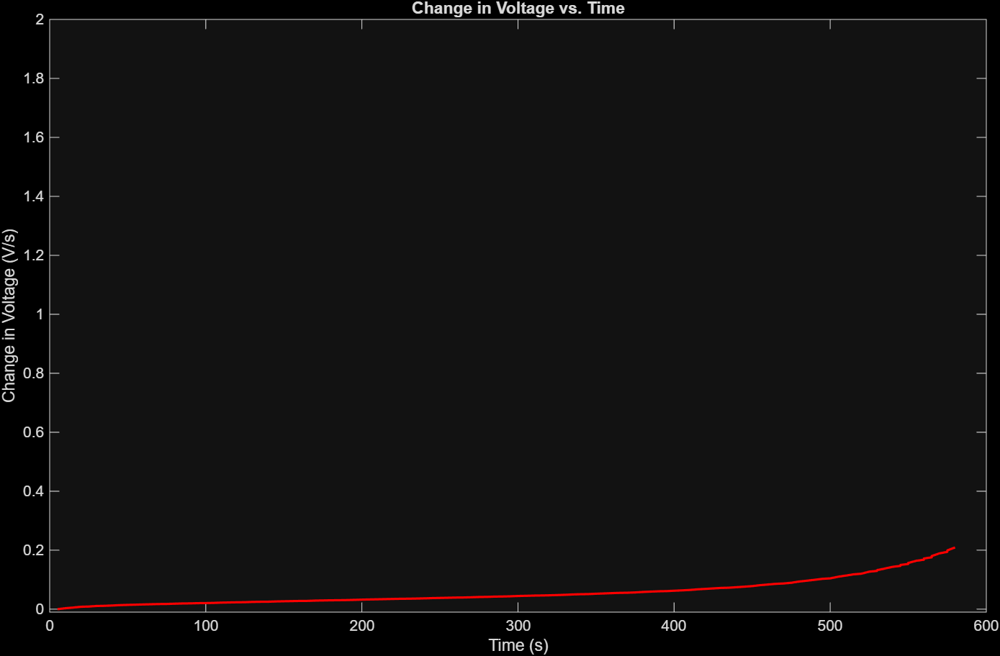
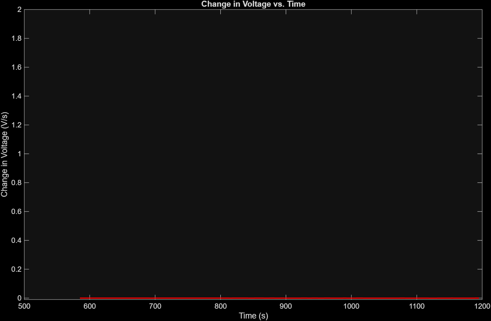

<table>
<tr>
<td width="20% align="center">

</td>

<td width="80%">

<h1>Battery Charging Profile Modeling and Analysis</h1>

Use MATLAB to model a lithium-ion battery charging profile using an RC circuit analog, curve fitting, numerical integration, and engineering analysis

</td>
</tr>
</table>

### Project Overview

This project uses MATLAB to model and analyze the charging behavior of a real lithium-ion battery. The battery charging profile is approximated using a first-order RC-circuit analog and an exponential charging model. The measured voltage data is fitted to an exponential charging model using the Curve Fitting Toolbox, while voltage, current, and power data are analyzed throughout a charging cycle. 

Numerical differentiation is used to examine the rate of voltage change, and numerical integration is used to calculate the total energy delivered to the battery. Charging time and estimated resistive energy losses are also calculated to evaluate the battery's charging performance. 

The results are presented through MATLAB-generated plots, goodness-of-fit statistics, and a summary of key charging characteristics. The project demonstrates how circuit modeling, calculus, and MATLAB-based data analysis can be applied to real-world battery systems. 

### Objective
The primary objective of this project is to develop a MATLAB-based model of a real lithium-ion battery charging profile using a first-order RC-circuit analogy. The project aims to determine how effectively this simplified model represents the battery's measured charging behavior and to use the resulting model the characterize the charging process. 

### Mathematical Model
A first-order RC circuit was used to approximate the charging characteristics of a lithium-ion battery. The voltage profile was modeled using the exponential charging equation:

$$
V(t)=V_{\text{max}}\left(1-e^{-t/(RC)}\right)
$$

where $V_{\text{max}}$ is the maximum battery voltage and (RC) represents the system time constant. MATLAB's Curve Fitting Toolbox was used to fit the exponential model to the measured battery voltage data and estimate the RC time constant that best represents the observed charging behavior.

--- 

## Methodology

### 1. Data Preparation
The lithium-ion battery cycling data provided by MathWorks was loaded into MATLAB and a single charging cycle was selected for analysis. Cycle 1 was used to avoid combining measurements from different stages of battery aging. 

The charging portion of the cycle was isolated using the measured current, with positive current representing the charging phase. The corresponding time, voltage, and current measurements were extracted for analysis. Time was converted to elapsed seconds beginning at (t=0) for the selected charging interval.

### 2. RC Model and Curve Fitting
The measured battery voltage was modeled using the prescribed first-order RC charging equation: 

$$
V(t)=V_{\text{max}}\left(1-e^{-t/\tau}\right)
$$

where $\tau=RC$ is the RC time constant. The maximum voltage was fixed at 3.6V based on the known maximum voltage of the battery dataset. 

MATLAB's Curve Fitting Toolbox was used to perform a nonlinear least-squares fit between the measured voltage data and the exponential model. The fitted time constant was constrained to remain positive, and goodness-of-fit statistics were calculated to evaluate how well the model represented the measured charging profile.

### 3. Electrical Characteristics
The voltage and current measurements were used to characterize the electrical behavior of the battery during the charging cycle. Instantaneous electrical power was calculated from the measured voltage and current using: 

$$
P(t)=V(t)I(t)
$$

The resulting voltage, current, and power data were plotted against time using MATLAB subplots. These plots provide a visual representation of how the electrical characteristics change throughout the charging process and allow different stages of the charging profile to be identified.

### 4. Charging and Energy Analysis
Numerical methods were used to evaluate key characteristics of the charging process. The rate of voltage change was calculated using numerical differentiation to determine how quickly the battery voltage changes throughout charging.

The total electrical energy delivered to the battery was calculated by numerically integrating the power over time: 

$$
E=\int P(t),dt
$$

The MATLAB trapz function was used to approximate the area under the power-time curve. The charging data was also analyzed to determine the time required for the battery to reach 80% and 100% of its specified maximum voltage.

Estimated resistive energy loss was calculated using the measured current and the battery's internal resistance.

---

## Results

### 1. RC Model Fit
The measured battery voltage was compared with the fitted first-order RC charging model. The model was fitted to the selected charging data using MATLAB's Curve Fitting Toolbox, with the maximum voltage set to the specified value for the battery dataset. 

 

<b>Figure 1.</b> Measured Battery Voltage compared with the fitted first-order RC charging model.

The fitted model produced an RC time constant of **0.22793 s**, with an $R^2$ value of **0.22936** and an RMSE of **0.27328 V**. The relativity low $R^2$ value indicates that the first-order RC model does not closely represent the measured voltage data over the selected charging cycle. 

The difference between the measured data and the fitted model demonstrates the limitations of representing a real lithium-ion battery using a simple first-order RC circuit.

### 2. Voltage, Current, and Power
The voltage, current, and power measurements were analyzed over the selected battery charging cycle. Electrical power was calculated from the measured voltage and current using:

$$
P(t)=V(t)I(t)
$$

The resulting measurements were plotted as functions of elapsed time to visualize the electrical behavior of the battery throughout the cycle.

<td align="center">
<table>
  <tr>
    <td align="center"><b>Voltage vs. Time</b></td>
    <td align="center"><b>Current vs. Time</b></td>
    <td align="center"><b>Power vs. Time</b></td>
  </tr>
  <tr>
    <td></td>
    <td></td>
    <td></td>
  </tr>
</table>
</td>

<b>Figure 2.</b> Voltage, current, and power measurements during the selected battery charging cycle.

The voltage initially increases from approximately 2.02 V to 3.56 B within the first 300 seconds. After reaching this initial peak, the voltage continues to fluctuate before eventually settling near 2.0 V toward the end of the measured cycle. 

The current initially increases to approximately 6.54 A and remains relatively constant for the first 300 seconds. It then decreases through several stages before eventually becoming negative, reaching approximately -4.40 A and remaining near this value for a portion of the cycle. Near the end of the cycle, the current rises back toward zero. 

Because power is calculated from the measured voltage and current, its behavior follows changes in both quantities. The power initially reaches approximately 23.47 W before decreasing as the current changes. Later in the cycle, the power becomes negative when the measured current becomes negative, indicating that the direction of electrical power flow has changed relative to the initial portion of the cycle. 

### 3. Energy and Charging Performance
Charging performance was evaluated by calculating the electrical energy delivered to the battery and the energy dissipated through internal resistance. Electrical power was calculated as

$$
P(t)=V(t)I(t)
$$

and energy was determined from the accumulated power over time. Resistive losses were estimated using

$$
P_{\text{loss}}=I^2R
$$

The charging-time analysis was also used to determine the time required to reach 80% and 100% of the target voltage.

<td align="center">
<table>
  <tr>
    <td align="center"><b>Stage 1</b></td>
    <td align="center"><b>Stage 2</b></td>
    <td align="center"><b>Stage 3</b></td>
    <td align="center"><b>Stage 4</b></td>
  </tr>
  <tr>
    <td></td>
    <td></td>
    <td></td>
    <td></td>
  </tr>
</table>
</td>

<b>Figure 3.1.</b> Electrical energy delivered to the battery over time during the charging stages.

 

<b>Figure 3.2.</b> Estimated energy loss during the charging process.

The results show how electrical energy is transferred during charging while a portion is dissipated through internal resistance. The charging process also becomes slower as the battery approaches its maximum voltage, resulting in a significant difference between the time required to reach 80% and 100% charge.

### 4. CC-CV Phase Analysis
The battery charging profile was separated into constant-current (CC) and constant-voltage (CV) phases based on the measured battery voltage and charging current. The CC-to-CV transition was identified when the battery voltage reached approximately 99.9% of the 3.6 V voltage set point. During the CC phase, the charging current remained relatively steady while the battery voltage increased. After the transition, the voltage remained near the set point while the charging current decreased during the CV phase.

The voltage, current, power, and voltage rate of change were plotted against elapsed charging time to visualize the transition between the two phases. The red dashed line indicates the identified CC-to-CV transition.

 

<b>Figure 4.</b> Battery voltage, current, power, and voltage rate of change during the CC and CV charging phases.

The two phases were also modeled separately using exponential functions. The CC phase was modeled using an exponential voltage rise, while the CV phase was modeled using an exponential current decay. The resulting time constants, $R^2$ values, and RMSE values were used to evaluate the behavior of each phase.

Power and energy were calculated separately for the CC and CV phases to compare their contributions to the overall charging process. The analysis also estimated the Joule losses and efficiency of each phase using the measured internal resistance.

### Model Access

To access the battery charging model and results, clone the GitHub repository to your local machine using `git clone`. Navigate to the `MATLAB Live Script` folder and open `Batter_Analytical_Computations.mlx`. The MATLAB Live Script contains the instructions, calculations, and analysis used in our model. The resulting graphs can be viewed directly within the Live Script after opening and running the corresponding sections.

---

## Summary

| Metric | Value |
|---|---:|
| Maximum Voltage | 3.60 V |
| RC Fit Time Constant | 0.22793 s |
| Analytical Time Constant | 1.645 s |
| Time to 80% Charge | 2.6 s |
| Time to Full Charge | 1,246 s |
| Total Energy Delivered | 15,751.77 J |
| Resistive Energy Loss | 331.74 J |
| $R^2$ | 0.22936 |
| RMSE | 0.27328 V |

Overall, the results demonstrate that they battery's charging behavior changes significantly throughout the charging process. The voltage increases most rapidly during the early stages before approaching a stable maximum voltage. At the same time, current and power decrease during the later portion of charging, reducing the rate of energy transfer and resistive energy loss. The numerical energy and rate-of-change analyses provide additional measures of charging performance beyond the voltage profile alone.

## Authors

| Name | School | Major |
|-------|-------|-------|
| Duc Thuan Nguyen | UC San Diego | Electrical Engineering |
| Matthew Garcia | Cal State Long Beach | Computer Engineering |
| Shreya Pandey | UC Los Angeles | Chemical Engineering |
| Karen Portillo | UC Irvine | Electrical Engineering |
